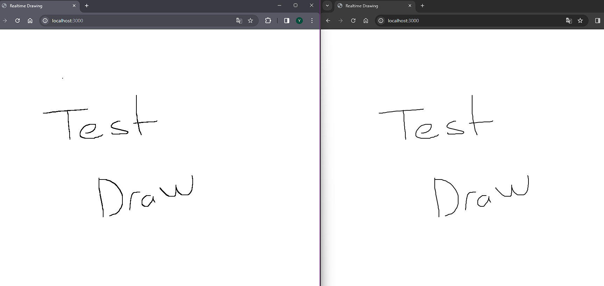

# Realtime Drawing

This project is built using Socket.IO and Paper.js for real-time drawing collaboration.



## Table of Contents
- [Realtime Drawing](#realtime-drawing)
  - [Table of Contents](#table-of-contents)
  - [Features](#features)
  - [Installation](#installation)
  - [Usage](#usage)
  - [Contributing](#contributing)
  - [License](#license)

## Features
- Real-time drawing collaboration using Socket.IO
- Responsive canvas that fills the entire screen
- Simple and easy-to-understand code structure

## Installation
1. Clone the repository:
   ```bash
   git clone https://github.com/yldrykuru/realtime-drawing.git
   ```
2. Install dependencies:
   ```bash
   cd realtime-drawing
   npm install
   ```
## Usage
1. Start the server:
   ```bash
   npm start
   ```
2. Open your browser and go to http://localhost:3000.
3. Collaborate with others in real-time by drawing on the canvas.

## Contributing

Contributions are welcome! If you'd like to contribute to this project, please follow these guidelines:

- Fork the repository
- Create a new branch for your feature or bug fix
- Commit your changes and push to your branch
- Create a pull request

## License
This project is licensed under the MIT License. See [LICENSE](LICENSE.md) for more information.
